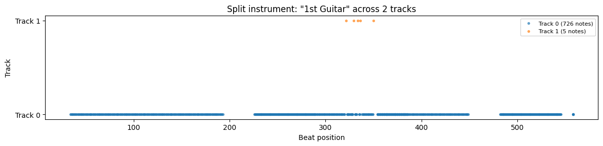
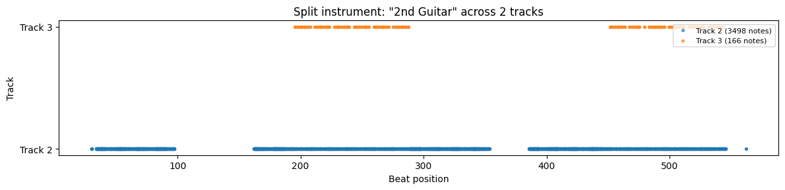

# Encoding & Decoding Guide

How The Jam Machine converts MIDI files to text tokens and back.

---

## What's in a MIDI File

A MIDI file contains:
- **Instruments** — each with a program number (0-127) identifying the sound (piano, bass, drums, etc.)
- **Notes** — each with a pitch (0-127), start time, end time, and velocity
- **Timing** — measured in ticks, with a resolution (e.g., 480 ticks per beat)
- **Tempo and time signature** — how fast and in what meter

The Jam Machine encodes all of this into a flat text sequence that a language model can learn.

---

## The Encoding Pipeline

```
MIDI File
  → miditok extracts events (Note-On, Time-Shift, etc.)
  → Velocity is removed (not used by the model)
  → Time shifts are normalized and quantized
  → Bar markers are added every 4 beats
  → Note density is computed per bar
  → Instruments are mapped to 16 families
  → Events are serialized to text tokens
```

### Step by step:

**1. Extract events.** The [miditok](https://github.com/Natooz/MidiTok) library converts each MIDI instrument track into a sequence of events: `Note-On`, `Note-Off`, `Time-Shift`, etc.

**2. Remove velocity.** Velocity (how hard a note is struck) is stripped out to reduce vocabulary size. All generated notes use a default velocity.

**3. Quantize time.** Time shifts are quantized to **4 steps per beat**. This means the finest resolution is a 16th note. Anything shorter (grace notes, humanized timing) is rounded to the nearest step.

**4. Add bar markers.** `BAR_START` and `BAR_END` tokens are inserted every 4 beats (one bar in 4/4 time).

**5. Compute density.** Each bar gets a `DENSITY` value (0-3) based on how many notes it contains. This gives the model a high-level knob for "how busy" a bar should be.

**6. Map instruments to families.** MIDI has 128 instrument programs. The model groups them into 16 families:

| Family | Name | MIDI Programs |
|--------|------|--------------|
| 0 | Piano | 0-7 |
| 1 | Chromatic Percussion | 8-15 |
| 2 | Organ | 16-23 |
| 3 | Guitar | 24-31 |
| 4 | Bass | 32-39 |
| 5 | Strings | 40-47 |
| 6 | Ensemble | 48-55 |
| 7 | Brass | 56-63 |
| 8 | Reed | 64-71 |
| 9 | Pipe | 72-79 |
| 10 | Synth Lead | 80-87 |
| 11 | Synth Pad | 88-95 |
| 12 | Synth Effects | 96-103 |
| 13 | Ethnic | 104-111 |
| 14 | Percussive | 112-119 |
| 15 | Sound Effects | 120-127 |

Drums are a special case: they use `INST=DRUMS` instead of a family number.

**7. Serialize to text.** Each event becomes a text token. The full piece is a single string of space-separated tokens.

---

## Token Vocabulary

### Structure tokens

| Token | Meaning |
|-------|---------|
| `PIECE_START` | Beginning of a piece |
| `TRACK_START` | Beginning of an instrument track |
| `TRACK_END` | End of an instrument track |
| `BAR_START` | Beginning of a bar (4 beats) |
| `BAR_END` | End of a bar |

### Metadata tokens

| Token | Meaning | Values |
|-------|---------|--------|
| `INST=<n>` | Instrument family | 0-15 or `DRUMS` |
| `DENSITY=<n>` | Note density of the bar | 0-3 |

### Note tokens

| Token | Meaning | Values |
|-------|---------|--------|
| `NOTE_ON=<pitch>` | Start playing a note | 0-127 (MIDI pitch) |
| `NOTE_OFF=<pitch>` | Stop playing a note | 0-127 |
| `TIME_DELTA=<steps>` | Wait before next event | 1-16 (4 steps = 1 beat) |

The total vocabulary is ~300 tokens.

---

## Worked Example: Reptilia Drums

Here's the actual encoded output for the first bar of drums from The Strokes - Reptilia:

```
TRACK_START
INST=DRUMS
DENSITY=1
BAR_START
  TIME_DELTA=2        ← wait half a beat
  NOTE_ON=35          ← kick drum (GM note 35)
  NOTE_OFF=35         ← release kick
  NOTE_ON=40          ← electric snare (GM note 40)
  NOTE_OFF=40         ← release snare
  NOTE_ON=40          ← snare again
  NOTE_OFF=40
  TIME_DELTA=4        ← wait one full beat
  NOTE_ON=35          ← kick drum
  TIME_DELTA=2        ← wait half a beat
  NOTE_OFF=35
  TIME_DELTA=2        ← wait half a beat
  NOTE_ON=40          ← snare
  TIME_DELTA=2
  NOTE_OFF=40
BAR_END
```

Reading this like a timeline: the bar starts with a half-beat rest, then a kick+snare hit, another snare, a full beat rest, another kick, and a snare — a classic rock drum pattern.

---

## Quantization Caveats

The encoding is **lossy**. Here's what's lost:

**Timing resolution.** Time is quantized to 4 steps per beat (16th-note grid). Sub-quantization timing — guitar strums where strings are hit in rapid succession, grace notes, humanized timing offsets — is rounded to the nearest step. Offsets smaller than one step are discarded entirely (the `TIME_DELTA=0` tokens are dropped).

**Velocity.** All note velocities are stripped during encoding and replaced with a default value during decoding.

**Instrument specificity.** A specific MIDI program (e.g., program 33 = Electric Bass Finger) becomes family 4 (Bass). During decoding, a random program from that family is assigned back.

**This is by design.** The quantization reduces the vocabulary size and makes patterns easier for the model to learn. The trade-off is that the decoded MIDI won't perfectly reproduce the original — but the musical content (which notes, when, which instruments) is preserved.

**The resolution is fixed by the trained model's vocabulary.** Changing the quantization would require retraining the model on a new dataset encoded with the new resolution.

---

## Decoding: Text Back to MIDI

The reverse pipeline:

```
Text Tokens
  → Parse tokens back to events
  → Reconstruct time shifts from TIME_DELTA values
  → Fill missing time shifts at bar boundaries
  → Add default velocity to all notes
  → Map instrument families back to MIDI programs
  → Assemble into a MIDI file via miditok
```

The decoder handles edge cases like bars with no notes (empty density=0 bars) and over-quantized events that exceed the bar length.

---

## Piano Roll: Decoded Reptilia

Here's the piano roll of The Strokes - Reptilia after a full encode → decode roundtrip:


The musical structure is preserved — you can see the distinct instrument tracks, the verse/chorus structure, and the rhythmic patterns. The timing has been quantized to the 16th-note grid, and instruments have been mapped to families, but the song is recognizable.

### Split instruments

Some MIDI files have a single instrument split across multiple tracks (common with guitar overdubs). Here's how Reptilia's 1st Guitar appears across two tracks:



Track 0 carries the main part (726 notes spanning the full song), while Track 1 has just 5 notes in a short section — likely a brief harmony or overdub.

The 2nd Guitar shows a similar pattern — a main track with 3498 notes and a secondary track with 166 notes appearing in two sections:



---

[Back to home](.)
